# 📘 Spring Framework & Spring Boot — Complete Illustrated Study Guide

*A university-level, beginner-to-intermediate reference for Java backend development with Spring.*

> **📍 Status: Part 1 of 2 — Chapters 1–9**
> Part 2 (Chapters 10–17: Database Connectivity → REST APIs → Full Architecture → Project Structure → Best Practices → Complete Request Lifecycle → Interview Questions → Summary) will be appended to this same file next, so the document grows into one complete guide.

---

## 📑 Table of Contents

**Part 1 (included below)**
1. [Introduction](#chapter-1--introduction)
2. [Client-Server Architecture](#chapter-2--client-server-architecture)
3. [Traditional Java Web Development](#chapter-3--traditional-java-web-development)
4. [Java Servlets](#chapter-4--java-servlets)
5. [Problems Before Spring](#chapter-5--problems-before-spring)
6. [Spring Framework](#chapter-6--spring-framework)
7. [Spring Ecosystem](#chapter-7--spring-ecosystem)
8. [Spring MVC](#chapter-8--spring-mvc)
9. [Spring Boot](#chapter-9--spring-boot)

**Part 2 (coming next)**
10. Database Connectivity
11. REST APIs
12. Complete Spring Boot Architecture
13. Project Structure
14. Best Practices
15. Complete Request Lifecycle
16. Interview Questions
17. Summary

---

## Chapter 1 — Introduction

### What is Backend Development?

Every application a person uses has two halves. The **frontend** is what you see and touch — buttons, forms, colors, layout. The **backend** is everything that happens out of sight: storing data, applying business rules, checking permissions, and deciding what the frontend is allowed to show.

> 🧠 **Analogy — The Restaurant**
> The frontend is the dining area: menus, tables, the waiter taking your order. The backend is the kitchen: where the actual cooking (logic), the pantry (database), and the recipes (business rules) live. You never enter the kitchen, but nothing reaches your table without it.

Backend development means building that "kitchen" — servers, databases, and the logic that connects them to whatever frontend (web, mobile, or another backend) is asking for data.

### What Happens When You Open a Website?

Typing a URL and pressing Enter triggers a surprisingly long chain of events. At a high level:

```mermaid
flowchart LR
    A[You type a URL] --> B[Browser resolves domain via DNS]
    B --> C[Browser opens a connection to the server]
    C --> D[Server receives the HTTP request]
    D --> E[Server runs backend logic]
    E --> F[Server may query a database]
    F --> G[Server builds a response]
    G --> H[Response travels back to the browser]
    H --> I[Browser renders the page]
```

Each arrow in that diagram is a topic in its own right — and most of this guide is dedicated to unpacking step **D through G**, which is where Spring lives.

### Frontend vs Backend

| Aspect | Frontend | Backend |
|---|---|---|
| Runs on | User's browser/device | Server |
| Visible to user? | Yes | No |
| Languages | HTML, CSS, JavaScript, React | Java, Python, Node.js, Go |
| Concerns | Layout, interaction, UX | Data, logic, security, storage |
| Example tools | React, Angular, Vue | Spring Boot, Django, Express |

### Client vs Server

- **Client**: the program that *requests* something — typically a browser, mobile app, or another backend service.
- **Server**: the program that *listens* for requests and responds — typically always running, waiting for clients to connect.

> 📝 **Note:** "Client" and "server" describe a *role* in a conversation, not a type of machine. A backend service can be a client when it calls a different backend service (e.g., a payment gateway).

### Request and Response

Communication between client and server always follows the same pattern: the client sends a **request**, the server replies with a **response**. Nothing happens unless a request initiates it — servers don't push data to clients uninvited under plain HTTP.

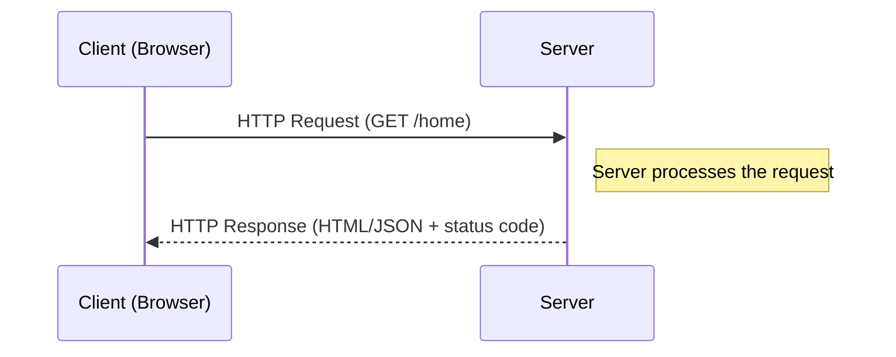

### Static vs Dynamic Websites

| Feature | Static Website | Dynamic Website |
|---|---|---|
| Content | Same for every visitor | Changes based on user/data |
| Built with | Plain HTML/CSS | Backend + database |
| Example | A portfolio page | An e-commerce store, social feed |
| Server's job | Just hand over the file | Run logic, query DB, build response |

> 💡 **Tip:** Almost everything you'll build with Spring Boot is dynamic — that's the entire reason a backend framework exists. A purely static site doesn't need Spring at all.

### Browser → Server → Database → Browser

This is the single most important diagram in backend development. Internalize it before moving forward — every chapter from here on is essentially zooming into one box of this picture.

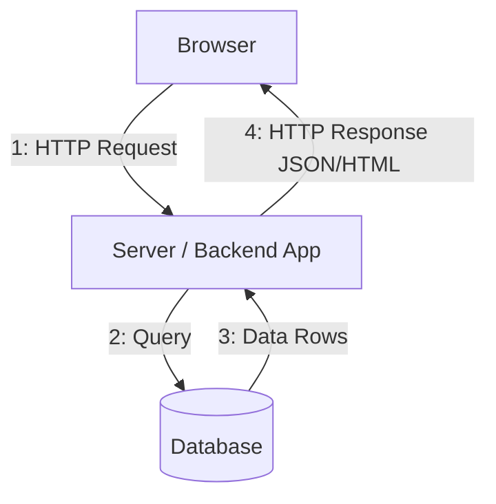

> ⚠️ **Common Mistake:** Beginners often think the browser talks to the database directly. It never does (and should never be allowed to) — the server is the only thing permitted to touch the database. This is a deliberate security boundary, not a technical limitation.

---

## Chapter 2 — Client-Server Architecture

### Client, Server, and the Different Kinds of "Server"

The word "server" gets overloaded. In a real system you'll actually deal with several distinct roles:

| Term | What it actually does |
|---|---|
| **Web Server** | Handles raw HTTP traffic, often serves static files (e.g., Nginx, Apache HTTP Server) |
| **Application Server** | Runs your actual business logic (e.g., embedded Tomcat inside Spring Boot) |
| **Database Server** | Stores and manages persistent data (e.g., PostgreSQL, MySQL) |

In a small Spring Boot project, the **web server and application server are the same process** — Spring Boot ships with an embedded Tomcat that does both jobs. In larger production systems, a dedicated web server (like Nginx) often sits in front of the application server as a reverse proxy.

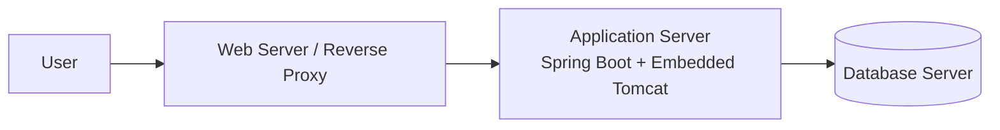

### HTTP, HTTPS, and TCP/IP

- **TCP/IP** is the low-level protocol suite that guarantees data actually arrives, in order, between two machines. Think of it as the postal system's delivery trucks — it doesn't care *what's* in the package, only that it gets there intact.
- **HTTP** (HyperText Transfer Protocol) is the *language* clients and servers speak on top of TCP/IP — a shared format for "here's my request" and "here's my response."
- **HTTPS** is HTTP wrapped in TLS encryption — same conversation, but locked in an envelope only the two endpoints can read.

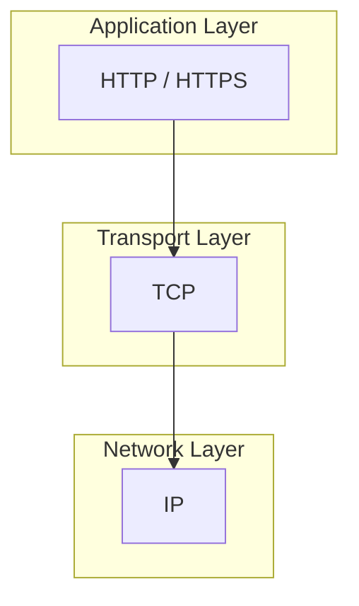

> 🧠 **Analogy:** TCP/IP is the phone line guaranteeing your voice arrives clearly. HTTP is the language (English, Nepali, whatever) you speak over that line. HTTPS is that same conversation held in code so eavesdroppers on the line can't understand it.

### HTTP Request Structure

```http
POST /api/users HTTP/1.1
Host: example.com
Content-Type: application/json
Authorization: Bearer eyJhbGciOi...

{
  "name": "Sharwan",
  "email": "sharwan@example.com"
}
```

| Part | Purpose |
|---|---|
| Method (`POST`) | What action to perform |
| Path (`/api/users`) | Which resource |
| Headers | Metadata (content type, auth token, etc.) |
| Body | The actual data being sent (optional for GET) |

### HTTP Response Structure

```http
HTTP/1.1 201 Created
Content-Type: application/json

{
  "id": 42,
  "name": "Sharwan",
  "email": "sharwan@example.com"
}
```

| Part | Purpose |
|---|---|
| Status line (`201 Created`) | Outcome of the request |
| Headers | Metadata about the response |
| Body | The actual data returned (optional) |

### The Five Core HTTP Methods

| Method | Purpose | Example | Idempotent? |
|---|---|---|---|
| `GET` | Retrieve data | `GET /users/5` | ✅ Yes |
| `POST` | Create new data | `POST /users` | ❌ No |
| `PUT` | Replace data entirely | `PUT /users/5` | ✅ Yes |
| `PATCH` | Partially update data | `PATCH /users/5` | ⚠️ Usually, not guaranteed |
| `DELETE` | Remove data | `DELETE /users/5` | ✅ Yes |

> 📝 **Note — "Idempotent" matters for exams:** An idempotent request produces the same end state no matter how many times it's repeated. Calling `DELETE /users/5` five times in a row leaves the system in the same state as calling it once (user 5 is gone). Calling `POST /users` five times creates five separate users — that's why POST is *not* idempotent.

### Request Lifecycle Diagram

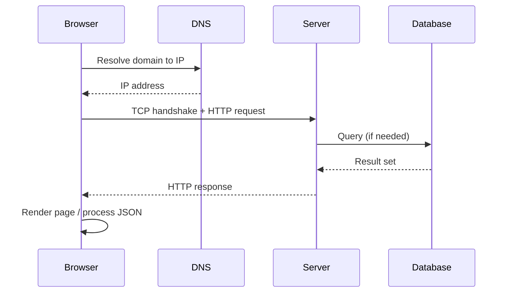

### Communication Flowchart

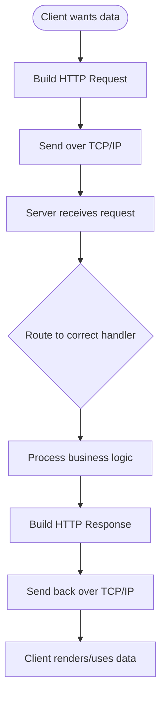

---

## Chapter 3 — Traditional Java Web Development

Before frameworks like Spring existed, Java developers built network applications by hand using raw **sockets**. Understanding why this was painful is the fastest way to appreciate why Spring exists.

### Socket Programming

A socket is a low-level endpoint for sending and receiving bytes over a network. Writing a server with raw sockets means manually handling everything HTTP normally abstracts away for you.

```java
// A bare-bones socket server — no HTTP parsing, no routing, nothing
ServerSocket serverSocket = new ServerSocket(8080);

while (true) {
    Socket clientSocket = serverSocket.accept(); // blocks until a client connects
    InputStream input = clientSocket.getInputStream();
    OutputStream output = clientSocket.getOutputStream();

    // You would now have to manually:
    // 1. Read raw bytes and parse them as an HTTP request yourself
    // 2. Figure out the method, path, and headers by hand
    // 3. Decide what logic to run
    // 4. Manually construct a valid HTTP response string
    // 5. Write it back as bytes
}
```

> ⚠️ **Why this is painful:** HTTP is a text protocol with very specific formatting rules (status lines, header formats, content-length calculations). Getting any of it slightly wrong breaks the response for every browser that tries to read it. None of this logic has anything to do with *your actual application* — it's pure plumbing.

### Manual Thread Management

A server needs to handle many clients at once. With raw sockets, that means manually spinning up a thread per connection:

```java
while (true) {
    Socket clientSocket = serverSocket.accept();
    new Thread(() -> handleClient(clientSocket)).start(); // manual, error-prone
}
```

### The Core Problems

| Problem | Why it hurts |
|---|---|
| **Scalability** | Thousands of manually-managed threads exhaust memory and CPU context-switching |
| **Response handling** | Every response must be hand-built as a correctly formatted HTTP string |
| **Error handling** | A single malformed request can crash the handling thread |
| **No reusability** | Every project reinvents the same low-level plumbing |
| **Security** | Parsing untrusted raw input by hand is a minefield of bugs |

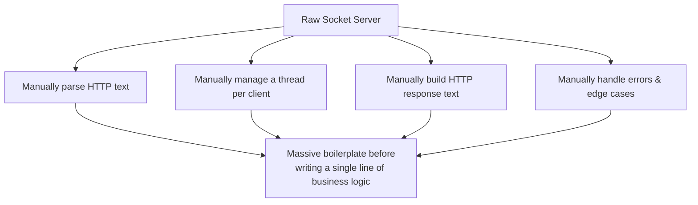

This is exactly the gap that **Servlets**, and later **Spring**, were built to close.

---

## Chapter 4 — Java Servlets

### What is a Servlet?

A **Servlet** is a Java class that handles HTTP requests and responses *without* requiring you to manually parse sockets. It's a standardized contract: implement a few methods, and a **Servlet Container** handles all the raw networking for you.

> 🧠 **Analogy:** If raw socket programming is building your own car engine from scratch, a Servlet is being handed a car with an engine already installed — you just need to tell it where to drive.

### Why Servlets Were Created

Servlets exist specifically to solve every problem listed at the end of Chapter 3: they hide socket management, thread pooling, and raw HTTP parsing behind a clean Java API (`doGet`, `doPost`, etc.).

```java
public class HelloServlet extends HttpServlet {

    @Override
    protected void doGet(HttpServletRequest req, HttpServletResponse resp)
            throws IOException {
        resp.setContentType("text/plain");
        resp.getWriter().write("Hello from a Servlet!");
    }
}
```

Notice what's *missing* compared to Chapter 3: no `ServerSocket`, no manual thread, no hand-built response string. The container did all of that already.

### Servlet Container & Apache Tomcat

A **Servlet Container** (also called a *web container*) is the runtime that manages Servlets: it accepts raw connections, parses HTTP, finds the right Servlet for each URL, and calls its lifecycle methods. **Apache Tomcat** is the most widely used Servlet Container — and it's the exact engine Spring Boot embeds inside every application by default.

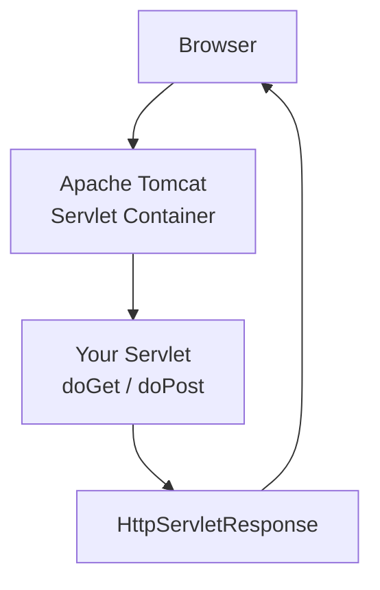

### Servlet Lifecycle

A Servlet doesn't live forever and isn't recreated per request either — the container manages a clear lifecycle:

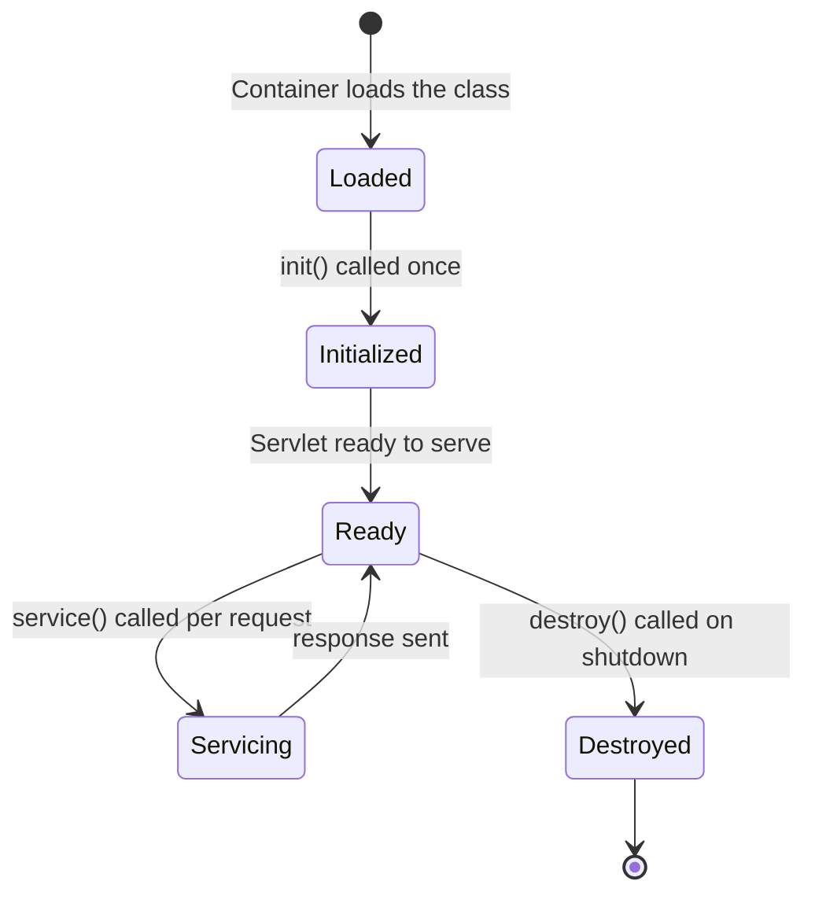

| Method | Called when | Frequency |
|---|---|---|
| `init()` | Servlet is first loaded into memory | Once |
| `service()` (→ `doGet`/`doPost`/etc.) | Every incoming request | Per request |
| `destroy()` | Container is shutting down | Once |

> 📝 **Note:** A single Servlet *instance* handles many requests concurrently using a thread pool the container manages for you — this is precisely the "manual thread management" pain from Chapter 3, solved once, by the container, for every Servlet you'll ever write.

### Still Not Enough

Servlets remove the networking pain, but raw Servlet code still tends to mix HTTP handling, business logic, and HTML generation in the same class — which is exactly the **tight coupling** problem covered next.

---

## Chapter 5 — Problems Before Spring

Even with Servlets handling the network layer, large Java applications written with plain Servlets and manually-instantiated objects ran into a different category of problem — not about networking, but about **code structure**.

### Tight Coupling

When one class directly creates and depends on the concrete implementation of another, the two are *tightly coupled* — you cannot change, test, or replace one without touching the other.

```java
public class OrderService {
    // OrderService is now permanently glued to MySQLOrderRepository
    private MySQLOrderRepository repository = new MySQLOrderRepository();

    public void placeOrder(Order order) {
        repository.save(order);
    }
}
```

If you ever need to switch databases, mock the repository for a test, or support multiple implementations, you have to edit `OrderService` itself.

### Boilerplate Code & Manual Object Creation

Every object an application needs — database connections, services, utility classes — had to be manually `new`'d, often in deeply nested chains, with no central place managing *how* or *when* objects were created.

```java
// Multiplying by hand, all over the codebase
PaymentGateway gateway = new StripeGateway(new HttpClient(), new RetryPolicy(3));
OrderService orderService = new OrderService(new MySQLOrderRepository(), gateway);
NotificationService notifier = new NotificationService(new SmtpClient());
```

### Dependency Management

As an application grows, objects depend on other objects, which depend on still others. Wiring all of this together by hand, in the right order, becomes its own significant source of bugs.

### Difficult Testing

Because classes directly instantiate their own dependencies, you cannot substitute a fake/mock version for testing — `OrderService` above can never be tested without a real `MySQLOrderRepository` and a real database connection.

### Before vs After: A Direct Comparison

| Concern | Before (manual wiring) | After (Spring-managed) |
|---|---|---|
| Object creation | `new` scattered everywhere | Centralized in a container |
| Swapping implementations | Requires editing dependent classes | Just change configuration |
| Unit testing | Hard — real dependencies required | Easy — inject mocks |
| Object lifecycle | Manual, inconsistent | Managed automatically |
| Coupling | Tight (concrete classes) | Loose (interfaces/abstractions) |

### A Small UML Picture of the Problem

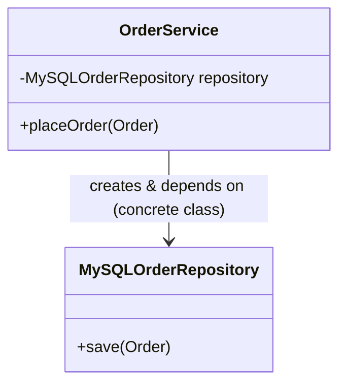

Notice the arrow: `OrderService` depends directly on a **concrete class**, not an interface. This is the structural disease Spring's **Inversion of Control** and **Dependency Injection** were specifically designed to cure — covered next.

---

## Chapter 6 — Spring Framework

### What is Spring?

**Spring** is a Java framework whose central job is to *create and wire your objects for you*, based on configuration, instead of you manually `new`-ing and connecting everything by hand. Everything else Spring offers (web support, data access, security) is built on top of this one core idea.

### Why Was Spring Created?

Spring was created in the early 2000s as a direct reaction to the exact pain points from Chapter 5 — and to the heavyweight, configuration-bloated alternative (early J2EE/EJB) of that era. Its philosophy can be summarized in one sentence:

> **"Don't create your own dependencies — describe what you need, and let a container hand you a ready-to-use object."**

### Inversion of Control (IoC)

In normal Java, *your code* controls when objects are created (`new SomeClass()`). **Inversion of Control** flips that: a container controls object creation, and your code simply *receives* what it needs.

> 🧠 **Analogy — The Restaurant, again:** Without IoC, you (the class) would have to walk into the kitchen, grow your own vegetables, and cook your own meal before you could eat. With IoC, you just sit down and the kitchen (the container) brings the meal to you, fully prepared, exactly when you need it.

### Dependency Injection (DI)

**Dependency Injection** is the *mechanism* by which IoC is actually implemented in Spring: required objects ("dependencies") are *injected* into a class from the outside, rather than the class creating them itself.

```java
@Service
public class OrderService {

    private final OrderRepository repository; // an interface, not a concrete class

    // Spring sees this constructor and automatically supplies a repository
    public OrderService(OrderRepository repository) {
        this.repository = repository;
    }

    public void placeOrder(Order order) {
        repository.save(order);
    }
}
```

Compare this directly to the tightly-coupled version in Chapter 5 — `OrderService` no longer knows or cares which database technology backs `OrderRepository`. Spring decides that, and hands the right implementation in automatically.

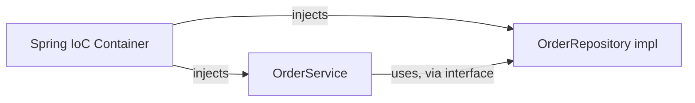

### Bean, BeanFactory, and ApplicationContext

| Term | Meaning |
|---|---|
| **Bean** | Any object whose lifecycle (creation, configuration, destruction) is managed by Spring |
| **BeanFactory** | The most basic Spring container — creates beans lazily, on demand |
| **ApplicationContext** | A richer container built on top of `BeanFactory` — adds event handling, internationalization, and eager bean initialization. This is what every real Spring application actually uses. |

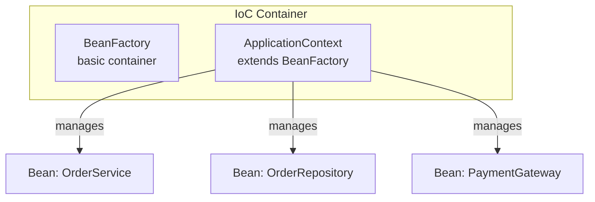

### Bean Lifecycle

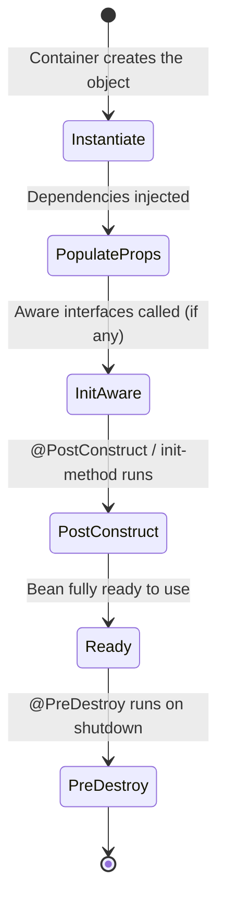

### A Minimal Bean Example

```java
@Configuration
public class AppConfig {

    @Bean
    public PaymentGateway paymentGateway() {
        return new StripeGateway();
    }
}
```

```java
@Component
public class CheckoutService {

    private final PaymentGateway gateway;

    public CheckoutService(PaymentGateway gateway) { // injected automatically
        this.gateway = gateway;
    }
}
```

> 💡 **Tip:** `@Component`, `@Service`, `@Repository`, and `@Controller` are all specialized versions of the same idea — "let Spring manage this class as a bean." The different names exist purely for *readability and tooling*, not different technical behavior at the container level.

---

## Chapter 7 — Spring Ecosystem

Spring isn't one library — it's a family of modules, each solving one specific backend concern, all built on the same core IoC container.

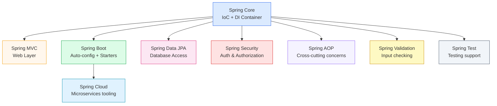

### Module-by-Module Breakdown

| Module | Solves | One-line summary |
|---|---|---|
| **Spring Core** | Object creation & wiring | The IoC container — the foundation everything else sits on |
| **Spring MVC** | Web requests | Routes HTTP requests to Java methods (Chapter 8) |
| **Spring Boot** | Configuration overload | Auto-configures everything with sane defaults (Chapter 9) |
| **Spring Data JPA** | Database boilerplate | Turns Java method calls into SQL automatically |
| **Spring Security** | Auth & access control | Login, JWT, role-based access, CSRF protection |
| **Spring AOP** | Repeated cross-cutting code | Logging, transactions, metrics applied without cluttering business logic |
| **Spring Cloud** | Microservices | Service discovery, config servers, circuit breakers |
| **Spring Validation** | Bad input | `@NotNull`, `@Email`, `@Size`, etc. enforced declaratively |
| **Spring Test** | Verifying behavior | `@SpringBootTest`, mocking beans, integration test support |

### What is AOP (Aspect-Oriented Programming)?

AOP lets you attach behavior — like logging or transaction management — to methods *without* writing that logic inside every method.

```java
@Aspect
@Component
public class LoggingAspect {

    @Before("execution(* com.sharwan.quoteservice.service.*.*(..))")
    public void logMethodCall(JoinPoint jp) {
        System.out.println("Calling: " + jp.getSignature());
    }
}
```

Every method inside the `service` package now gets logged automatically — none of those service classes had to mention logging at all. This is exactly how `@Transactional` works under the hood, too.

> 📝 **Note for exams:** A common differentiation question is *"Spring Core vs Spring Boot — what's the actual difference?"* Answer: Spring Core provides the IoC/DI container and is *configuration-heavy* by default. Spring Boot sits on top of Spring Core and adds auto-configuration, starter dependencies, and an embedded server so you barely configure anything manually. Spring Boot does not replace Spring — it's Spring, pre-configured.

---

## Chapter 8 — Spring MVC

### Model, View, Controller

**MVC** is a design pattern that separates an application into three responsibilities:

| Component | Responsibility |
|---|---|
| **Model** | The data — typically your DTOs or domain objects |
| **View** | How data is presented — HTML/Thymeleaf template, or in REST APIs, the JSON itself |
| **Controller** | Receives requests, calls business logic, decides what Model and View to use |

> 🧠 **Analogy:** Controller is the waiter taking your order and relaying it. Model is the food itself. View is how it's plated and presented at your table.

In a REST API built with Spring Boot (which is most of what you'll build), there usually is no separate "View" template — the Controller returns data directly as JSON, and the "view" is just that JSON's structure.

### Dispatcher Servlet

The **DispatcherServlet** is the single entry point for every HTTP request in a Spring MVC application. It's a specialized Servlet (Chapter 4) that doesn't handle requests itself — it figures out *which* of your `@Controller` methods should handle each request and delegates to it.

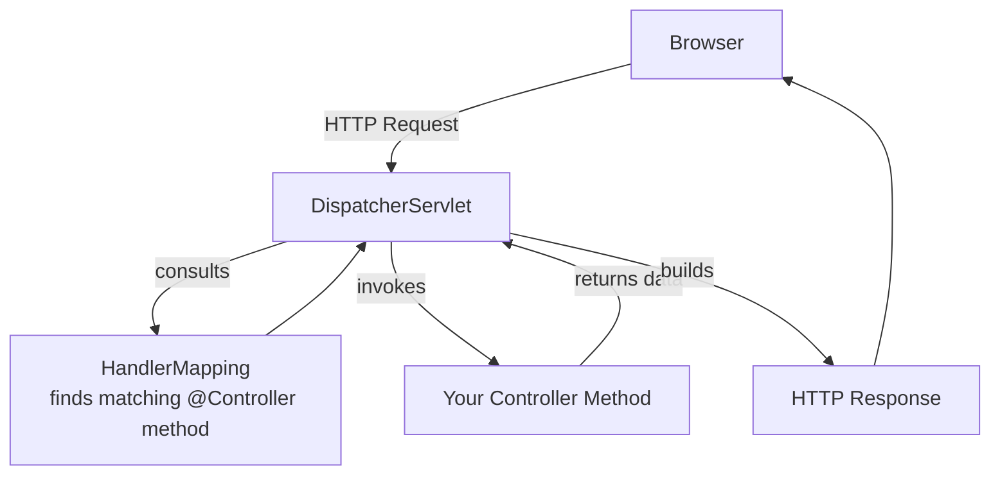

### Request Mapping

```java
@RestController
@RequestMapping("/api/users")
public class UserController {

    @GetMapping("/{id}")
    public User getUser(@PathVariable Long id) {
        // DispatcherServlet routed GET /api/users/5 here automatically
        return userService.findById(id);
    }
}
```

### Full Request Lifecycle Through Spring MVC

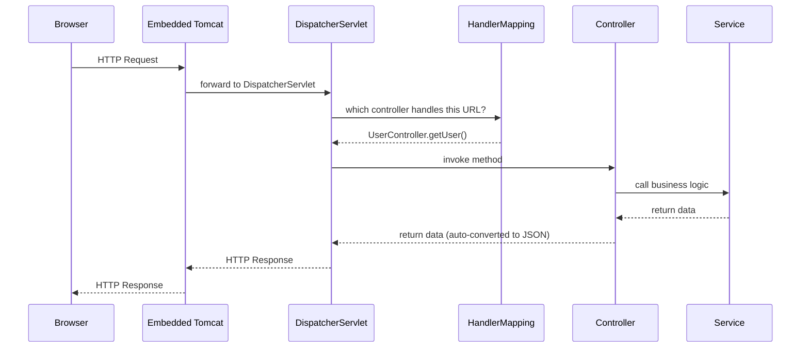

> 💡 **Tip:** `@RestController` is shorthand for `@Controller` + `@ResponseBody` — it tells Spring "every method's return value should be written directly into the HTTP response body (as JSON), not resolved as a view template name." This is *the* annotation you'll use for almost every controller you write in a REST API.

---

## Chapter 9 — Spring Boot

### Why Was Spring Boot Created?

Classic Spring solved object wiring (Chapter 6) — but configuring a project still required substantial manual XML or Java config: setting up a `DispatcherServlet`, configuring a database connection pool, choosing and embedding a server, and more, all by hand, before writing a single line of business logic.

**Spring Boot** was created to remove *that* remaining friction. Its philosophy:

> **"Convention over configuration — assume sensible defaults, and only ask the developer to configure what's actually unusual about their project."**

### Traditional Spring vs Spring Boot

| Aspect | Traditional Spring | Spring Boot |
|---|---|---|
| Server setup | Manually install & configure Tomcat | Embedded Tomcat, runs from `main()` |
| Configuration | Extensive XML/Java config required | Auto-configuration based on classpath |
| Dependencies | Choose & version-match every library yourself | Curated "starter" dependencies |
| Project setup | Manual, error-prone | Spring Initializr generates it instantly |
| Deployment | Build a WAR, deploy to external server | Build an executable JAR, just run it |
| Getting started time | Hours | Minutes |

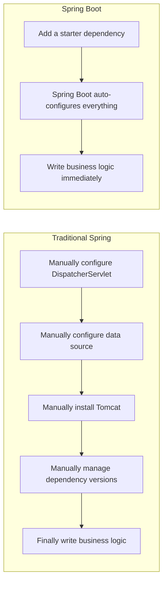

### Starter Dependencies

A **starter** is a single dependency that pulls in everything needed for one capability, with compatible versions already resolved for you.

```xml
<dependency>
    <groupId>org.springframework.boot</groupId>
    <artifactId>spring-boot-starter-web</artifactId>
</dependency>
```

That one entry transitively brings in Spring MVC, an embedded Tomcat, Jackson (for JSON), and validation support — all version-matched, with zero manual configuration.

### Auto-Configuration

Spring Boot inspects what's on your classpath and automatically configures beans accordingly. If it sees a PostgreSQL driver and `spring-boot-starter-data-jpa`, it automatically configures a `DataSource`, an `EntityManagerFactory`, and a `TransactionManager` — all without you writing a single `@Bean` method.

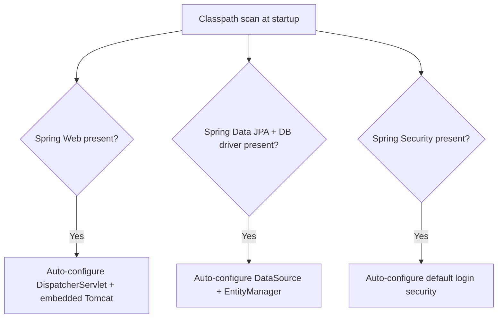

> ⚠️ **Common Mistake:** Auto-configuration is *convention*, not magic — it can always be overridden. Beginners sometimes assume they're stuck with Spring Boot's defaults; in reality, defining your own `@Bean` of the same type simply takes priority over the auto-configured one.

### Embedded Tomcat

Because Tomcat ships *inside* the application itself (rather than the application being deployed *into* an external Tomcat installation), a Spring Boot app is a self-contained, runnable JAR:

```bash
java -jar quote-service.jar
# Server starts immediately — no separate Tomcat installation needed
```

### Spring Initializr

[start.spring.io](https://start.spring.io) is a project generator: pick your build tool, language, Spring Boot version, and starter dependencies, and it produces a ready-to-run project skeleton with correct version-matched dependencies already in `pom.xml`.

### `@SpringBootApplication`

```java
@SpringBootApplication
public class QuoteServiceApplication {
    public static void main(String[] args) {
        SpringApplication.run(QuoteServiceApplication.class, args);
    }
}
```

`@SpringBootApplication` is itself a combination of three annotations:

| Combined annotation | What it actually does |
|---|---|
| `@SpringBootConfiguration` | Marks this class as a source of bean definitions |
| `@EnableAutoConfiguration` | Turns on the classpath-scanning auto-configuration from above |
| `@ComponentScan` | Tells Spring to scan this package (and sub-packages) for `@Component`, `@Service`, `@Repository`, `@Controller` classes |

### How Spring Boot Starts — Full Flowchart

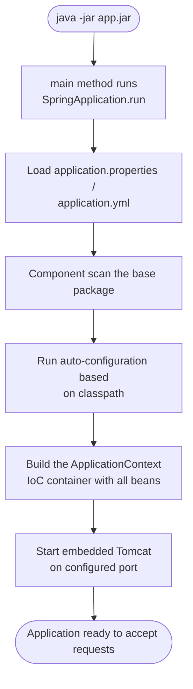

> 📝 **Note:** This startup sequence is a favorite interview question framed as *"what happens when you run a Spring Boot application?"* — being able to recite this flowchart in your own words (classpath scan → auto-configuration → bean container → embedded server start) is a strong, complete answer.

---

*End of Part 1. Reply to continue, and Chapters 10–17 — Database Connectivity, REST APIs, the Complete Spring Boot Architecture, Project Structure, Best Practices, the full Request Lifecycle diagram, 60 Interview Questions with answers, and the final Summary/Cheat Sheet — will be appended to this same file.*