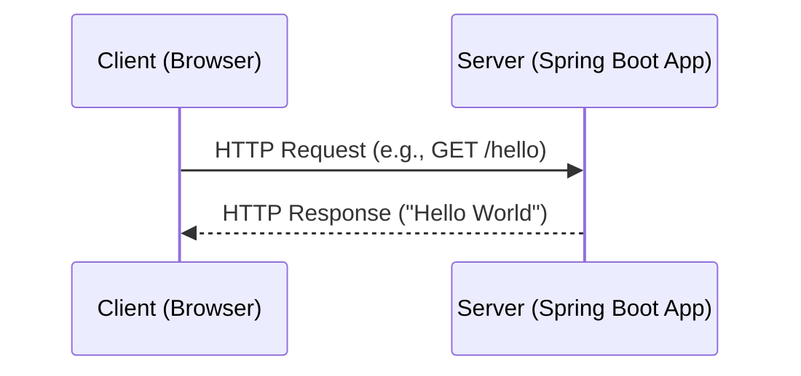
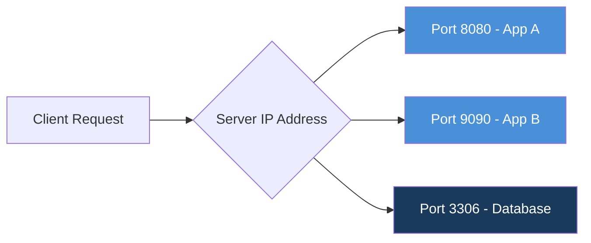
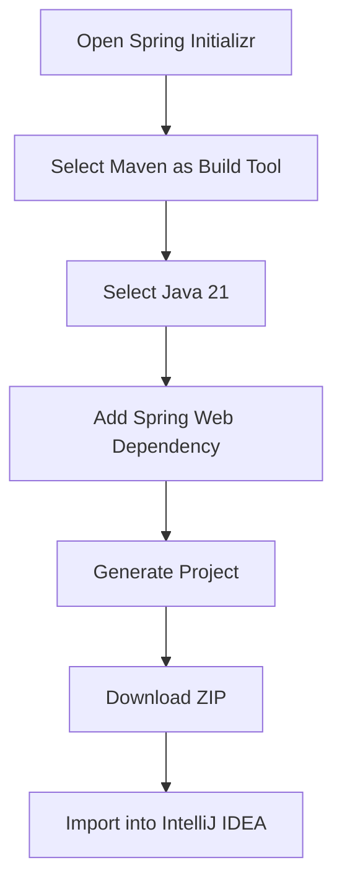
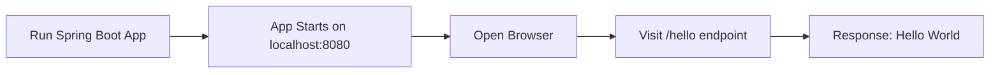
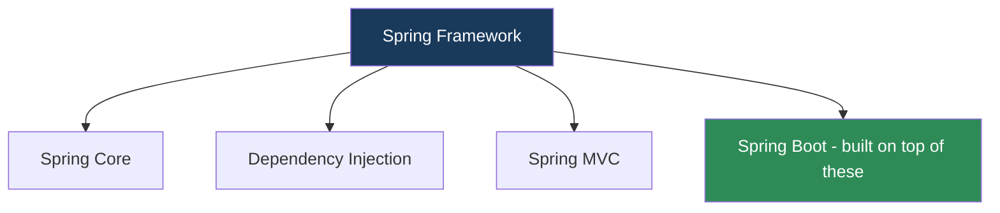

# Spring Boot — Introduction to Building Your First Application

A beginner-friendly study guide covering client-server basics, project setup with **Spring Initializr**, and building a simple REST endpoint using **Spring Boot**.

---

## Table of Contents

1. [Introduction](#1-introduction)
2. [Client-Server Architecture & Networking](#2-client-server-architecture--networking)
3. [Project Setup with Spring Initializr](#3-project-setup-with-spring-initializr)
4. [Coding the Application](#4-coding-the-application)
5. [Customization](#5-customization)
6. [Practical Steps (Quick Recap)](#6-practical-steps-quick-recap)
7. [Why Learn the Spring Framework Too?](#7-why-learn-the-spring-framework-too)
8. [Exam-Style Q&A](#8-exam-style-qa)
9. [Revision Checklist](#9-revision-checklist)
10. [Mnemonic](#10-mnemonic)
11. [Summary](#11-summary)

---

## 1. Introduction

**Spring Boot** is a framework that simplifies building Java applications by reducing manual configuration. Instead of spending time on setup, developers can focus directly on **business logic** — the actual functionality of the application.

> **Analogy:** Think of plain Spring Framework as building a car from individual parts (engine, wheels, wiring) yourself. Spring Boot is like buying a pre-assembled car — you can start driving (coding features) almost immediately.

---

## 2. Client-Server Architecture & Networking

### 2.1 How Client-Server Communication Works

- A **client** (e.g., a web browser) sends a **request** to a **server**.
- The **server** processes the request and sends back a **response**.
- This request-response cycle is the foundation of all web applications, including APIs built with Spring Boot.



### 2.2 IP Address

- An **IP Address** is a unique identifier used to locate a device or server on a network.
- It tells the client **which machine** to send the request to.

### 2.3 Port Number

- A single server (machine) can run **multiple applications** at the same time.
- A **port number** tells the system **which specific application** on that server should handle the incoming request.
- Combined, an **IP Address + Port Number** uniquely identifies an application instance on a network.



> **Note:** Without a port number, the server wouldn't know which of its running applications should respond to the request.

---

## 3. Project Setup with Spring Initializr

**Spring Initializr** is a web-based tool used to quickly generate a ready-to-use Spring Boot project template, removing the need to set up project structure manually.

### Key Selections While Generating the Project

| Setting | Value Chosen | Purpose |
|---|---|---|
| Build Tool | **Maven** | Manages project dependencies and build process |
| Language | **Java 21** | Programming language version used |
| Dependency | **Spring Web** | Adds everything needed to build web applications / REST APIs |



---

## 4. Coding the Application

### 4.1 Project Import

- The downloaded project is imported into **IntelliJ IDEA** (a popular Java IDE) for development.

### 4.2 Creating the Controller

A simple `HelloController` class is created to handle incoming web requests.

| Annotation | Purpose |
|---|---|
| **`@RestController`** | Marks the class as a controller whose methods return data directly (e.g., text, JSON) instead of rendering a web page |
| **`@GetMapping`** | Maps an HTTP **GET** request to a specific method (this defines an **endpoint**) |

```java
@RestController
public class HelloController {

    @GetMapping("/hello")
    public String sayHello() {
        return "Hello World";
    }
}
```

### 4.3 Running the Application



> **Tip:** The default URL to test the endpoint above would be `http://localhost:8080/hello`.

---

## 5. Customization

### 5.1 Changing the Default Port

- By default, Spring Boot runs on port **`8080`**.
- This can be changed (e.g., to `9090`) by editing the **`application.properties`** file:

```properties
server.port=9090
```

### 5.2 Adding More Endpoints

- Additional methods, each annotated with a mapping annotation like `@GetMapping`, can be added to the same controller (or new controllers) to handle more routes.

```java
@RestController
public class HelloController {

    @GetMapping("/hello")
    public String sayHello() {
        return "Hello World";
    }

    @GetMapping("/welcome")
    public String sayWelcome() {
        return "Welcome to Spring Boot!";
    }
}
```

> **Warning:** Each endpoint path (e.g., `/hello`, `/welcome`) must be unique within the application, or it will cause a mapping conflict.

---

## 6. Practical Steps (Quick Recap)

1. Go to **Spring Initializr** → select **Maven**, **Java 21**, **Spring Web**.
2. Generate and download the project.
3. Import the project into **IntelliJ IDEA**.
4. Create a controller class and annotate it with **`@RestController`**.
5. Add a method with **`@GetMapping("/hello")`** that returns a string.
6. Run the application and test the endpoint in a browser.
7. *(Optional)* Change the port in **`application.properties`** and add more endpoints.

---

## 7. Why Learn the Spring Framework Too?

Even though **Spring Boot** automates much of the setup, understanding the underlying **Spring Framework** is still important for deeper debugging and working with complex applications.



| Concept | What It Covers |
|---|---|
| **Spring Core** | The foundational container and core features of the Spring ecosystem |
| **Dependency Injection (DI)** | A design pattern where objects receive their dependencies rather than creating them, managed automatically by Spring |
| **Spring MVC** | The Model-View-Controller pattern used to handle web requests and responses |

> **Note:** Spring Boot doesn't replace these concepts — it builds on top of them and configures them automatically.

---

## 8. Exam-Style Q&A

**Q1: What is the purpose of a port number in client-server communication?**
A: It identifies which specific application on a server should handle an incoming request, since one server can run multiple applications simultaneously.

**Q2: What does `@RestController` do?**
A: It marks a class as a controller that returns data (such as text or JSON) directly in the HTTP response, instead of rendering a webpage.

**Q3: What does `@GetMapping` do?**
A: It maps a specific HTTP GET request URL (endpoint) to a method that handles that request.

**Q4: How do you change the default server port in a Spring Boot application?**
A: By setting `server.port=<new_port>` in the `application.properties` file.

**Q5: Why is it still useful to study the Spring Framework even when using Spring Boot?**
A: Spring Boot automates configuration but is built on Spring Framework concepts like Spring Core, Dependency Injection, and Spring MVC — understanding these helps with debugging and advanced customization.

---

## 9. Revision Checklist

- [ ] I understand the role of IP addresses and port numbers in networking.
- [ ] I can generate a project using Spring Initializr with Maven, Java 21, and Spring Web.
- [ ] I can create a `@RestController` class with a `@GetMapping` endpoint.
- [ ] I can run the application and test an endpoint in the browser.
- [ ] I can change the server port via `application.properties`.
- [ ] I know why Spring Core, DI, and Spring MVC matter beyond Spring Boot.

---

## 10. Mnemonic

**"I-P-S-C"** — to remember the build sequence:
- **I**nitializr (generate project)
- **P**ort & Properties (configure)
- **S**ervice/Controller (write code with `@RestController`)
- **C**heck in browser (test the endpoint)

---

## 11. Summary

This guide covers the basics of client-server communication (IP addresses, ports) and walks through creating a simple Spring Boot application using **Spring Initializr**, **`@RestController`**, and **`@GetMapping`**. It closes by emphasizing that understanding core **Spring Framework** concepts — Spring Core, Dependency Injection, and Spring MVC — remains essential beyond relying solely on Spring Boot's automation.