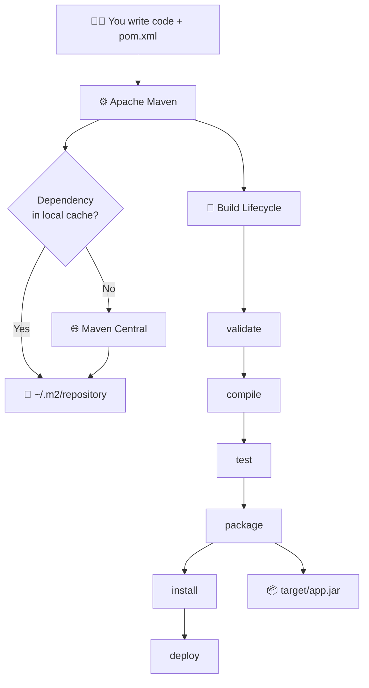
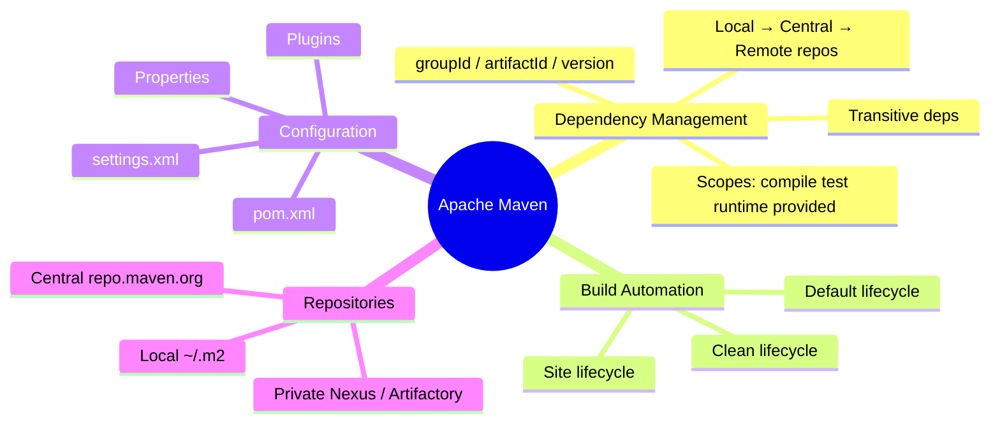
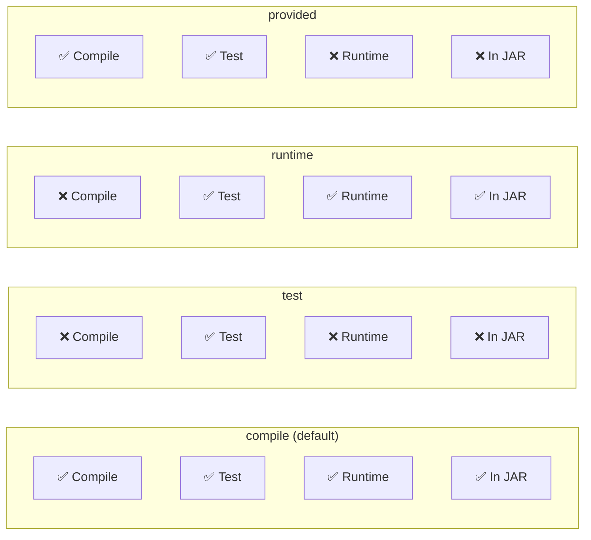
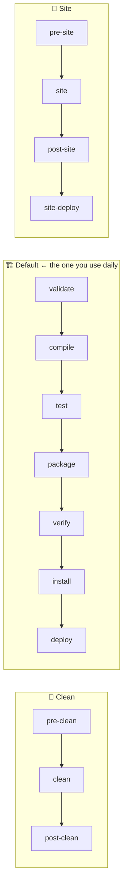
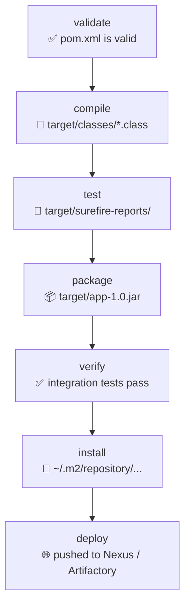
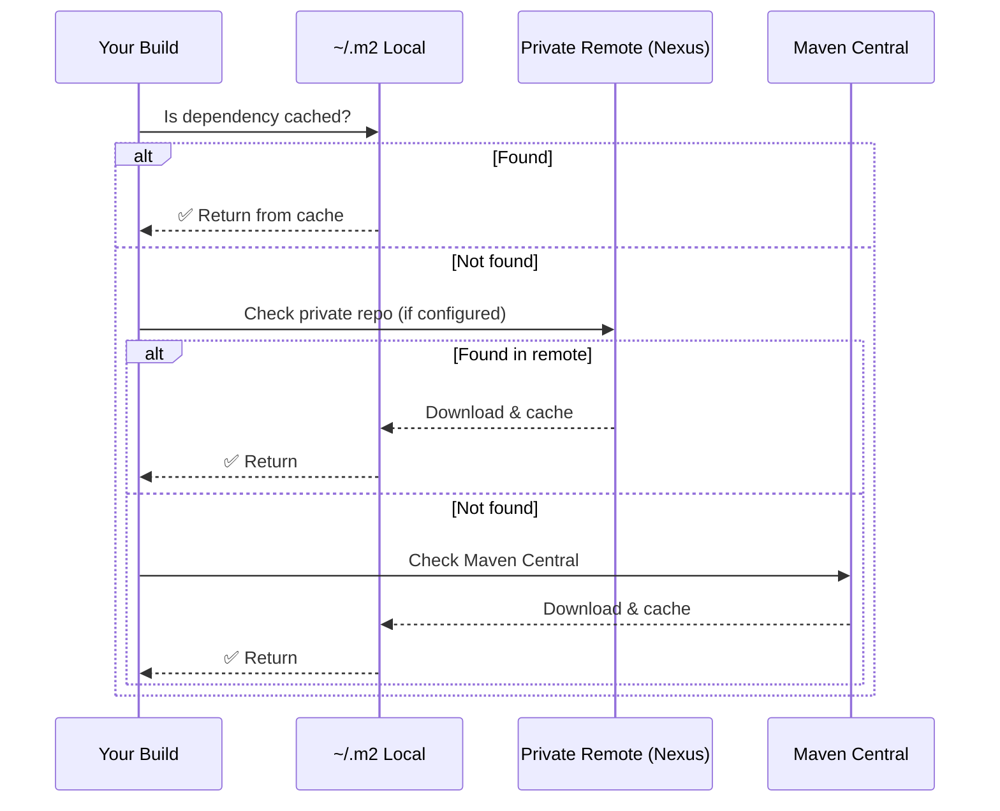
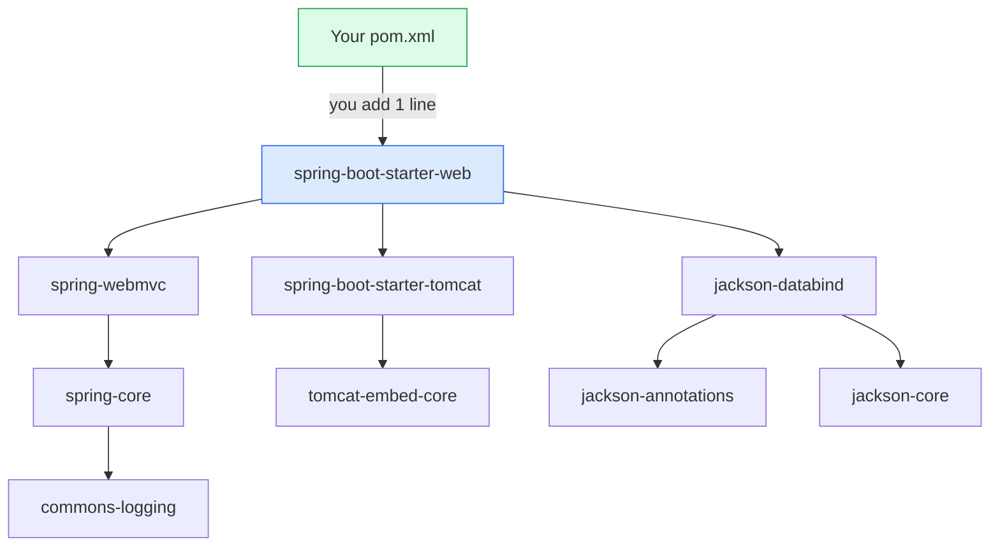
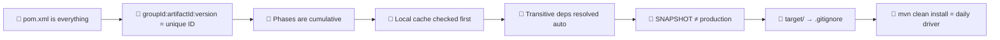

# ⚡ Apache Maven — Revision Notes

> *Fast-scan revision document. Read this when you haven't touched Maven in weeks and need to get back up to speed in 20 minutes. For deep explanations, see the full study guide.*

---

## 🗺️ The One Diagram to Remember



> Everything Maven does flows from a single file — `pom.xml` — and follows the arrows above.

---

## 🧠 Core Concept Map



---

## 📌 Quick-Fire Definitions

| Term | One-line meaning |
|---|---|
| **Maven** | Build tool + dependency manager for Java |
| **pom.xml** | The single config file that describes your entire project |
| **Artifact** | Any file Maven produces or manages (JAR, WAR, POM) |
| **Dependency** | A library your project needs to compile or run |
| **Transitive dependency** | A dependency of your dependency (Maven resolves automatically) |
| **Lifecycle** | An ordered sequence of build phases |
| **Phase** | One step inside a lifecycle (compile, test, package…) |
| **Plugin** | Provides the actual code that executes during a phase |
| **Goal** | A specific task a plugin can perform |
| **Local repo** | `~/.m2/repository` — Maven's disk cache on your machine |
| **SNAPSHOT** | A version still in development (re-checked each build) |
| **Release** | A finalized, immutable version |
| **Fat JAR** | JAR that bundles your code + all dependencies inside |
| **BOM** | Bill of Materials — centrally manages compatible dependency versions |

---

## 🏗️ pom.xml Skeleton — At a Glance

```xml
<project>
  <modelVersion>4.0.0</modelVersion>

  <!-- WHO this project is -->
  <groupId>com.sharwan</groupId>
  <artifactId>my-app</artifactId>
  <version>1.0.0-SNAPSHOT</version>
  <packaging>jar</packaging>

  <!-- PARENT — gives you managed versions for free -->
  <parent>
    <groupId>org.springframework.boot</groupId>
    <artifactId>spring-boot-starter-parent</artifactId>
    <version>4.0.0</version>
  </parent>

  <!-- PROPERTIES — reusable values -->
  <properties>
    <java.version>21</java.version>
  </properties>

  <!-- WHAT it needs -->
  <dependencies>
    <dependency>
      <groupId>org.springframework.boot</groupId>
      <artifactId>spring-boot-starter-web</artifactId>
      <!-- no version needed — parent manages it -->
    </dependency>
    <dependency>
      <groupId>org.springframework.boot</groupId>
      <artifactId>spring-boot-starter-test</artifactId>
      <scope>test</scope>   <!-- ← only in test classpath, never shipped -->
    </dependency>
  </dependencies>

  <!-- HOW to build it -->
  <build>
    <plugins>
      <plugin>
        <groupId>org.springframework.boot</groupId>
        <artifactId>spring-boot-maven-plugin</artifactId>
      </plugin>
    </plugins>
  </build>
</project>
```

---

## 📦 Maven Coordinates

```
groupId   :  artifactId          :  version
com.sharwan : spring-boot-starter-web : 4.0.0
     ↓               ↓                    ↓
Organisation      Project name         Release
(reverse domain)  (lowercase-hyphen)   (SemVer)
```

**Maps directly to a file path:**
```
~/.m2/repository/com/sharwan/my-app/1.0.0/my-app-1.0.0.jar
                  └─groupId─┘  └artId┘ └─ver─┘
```

---

## 🔍 Dependency Scope Cheat Sheet



| Scope | Compile? | Test? | Runtime? | In JAR? | Real example |
|---|:---:|:---:|:---:|:---:|---|
| `compile` | ✅ | ✅ | ✅ | ✅ | `spring-boot-starter-web` |
| `test` | ❌ | ✅ | ❌ | ❌ | `spring-boot-starter-test` |
| `runtime` | ❌ | ✅ | ✅ | ✅ | PostgreSQL JDBC driver |
| `provided` | ✅ | ✅ | ❌ | ❌ | `javax.servlet-api` (WAR deploy) |
| `optional` | ✅ | ✅ | ✅ | ❌ | Lombok, annotation processors |

> 🧠 **Quick rule of thumb:** If your Java code directly imports a class from it → `compile`. If only tests import it → `test`. If the JVM needs it at runtime but you never import it directly → `runtime`.

---

## 🔄 Build Lifecycle — Visual Flow



### What Each Phase Produces



> ⚠️ **Key rule:** Running any phase **also runs all phases before it**. `mvn package` = validate + compile + test + package all at once.

---

## 📂 Standard Directory Structure

```text
my-app/
├── pom.xml                       ← The only file you configure manually
├── src/
│   ├── main/
│   │   ├── java/com/sharwan/    ← Your application code (.java)
│   │   └── resources/            ← application.properties, static assets
│   └── test/
│       ├── java/com/sharwan/    ← Test classes (mirrors main structure)
│       └── resources/            ← Test-specific configs
│
└── target/                       ← Maven writes ALL output here
    ├── classes/                  ← Compiled .class files
    ├── surefire-reports/         ← Test results
    └── my-app-1.0.jar            ← Final artifact
```

> 💡 `target/` is always in `.gitignore`. Never commit it.

---

## 🌐 Repository Lookup Flow



### Repository Comparison

| | Local `~/.m2` | Maven Central | Private (Nexus) |
|---|---|---|---|
| Location | Your machine | Internet | Company server |
| Contains | Your cached downloads | All public open-source | Your private libraries |
| Checked | 1st (always) | Last resort | 2nd (if configured) |
| Speed | ⚡ Instant | Depends on network | Fast (LAN) |
| Offline builds | ✅ Yes (if cached) | ❌ No | ❌ No |

---

## 🔗 Transitive Dependency Chain



> One line in your pom.xml → Maven resolves 30+ jars automatically.

### Conflict Resolution Rule

```
Your pom.xml declares v1.2 ──────────────────────── WINS (nearest)
                                                          ↑
Library A → Library B → commons-logging v1.1 ─── further away, loses
```

**Fix a conflict:** declare the version you want explicitly in your own `pom.xml`. Root-level always wins.

---

## ⌨️ Command Reference

| Command | Phase(s) run | What it produces |
|---|---|---|
| `mvn validate` | validate | Error if pom.xml broken |
| `mvn compile` | validate → compile | `target/classes/` |
| `mvn test` | validate → compile → test | Test reports |
| `mvn package` | → through package | `target/*.jar` |
| `mvn verify` | → through verify | Integration test results |
| `mvn install` | → through install | JAR in `~/.m2` |
| `mvn deploy` | → through deploy | JAR on Nexus/Artifactory |
| `mvn clean` | clean lifecycle only | `target/` deleted |
| `mvn clean package` | clean + → package | Fresh JAR |
| `mvn clean install` | clean + → install | Fresh local install |
| `mvn dependency:tree` | — | Full transitive dep tree |
| `mvn dependency:resolve` | — | Download all deps, no build |
| `mvn help:effective-pom` | — | Print resolved merged POM |

### Most-Used Flags

| Flag | Use case |
|---|---|
| `-DskipTests` | Build fast locally, skip test execution |
| `-Dmaven.test.skip=true` | Skip compiling AND running tests |
| `-U` | Force re-check of SNAPSHOT versions |
| `-P prod` | Activate a profile named `prod` |
| `-X` | Debug mode (verbose output) |
| `-q` | Quiet mode (errors only) |

---

## 🆚 Key Comparisons

### JAR vs ZIP

| | JAR | ZIP |
|---|---|---|
| Format underneath | ZIP bytes | ZIP bytes |
| Runnable by JVM | ✅ `java -jar` | ❌ |
| Contains `MANIFEST.MF` | ✅ | ❌ |
| Used for | Java apps & libraries | General compression |

### SNAPSHOT vs Release

| | SNAPSHOT | Release |
|---|---|---|
| Example | `1.0.0-SNAPSHOT` | `1.0.0` |
| Immutable? | ❌ Re-downloaded if updated | ✅ Cached permanently |
| Safe for production? | ❌ Never | ✅ Yes |
| Maven re-checks? | ✅ Each build (or `-U`) | ❌ Cached forever |

### Maven vs Gradle vs Ant

| | Maven | Gradle | Ant |
|---|---|---|---|
| Config format | XML | Groovy/Kotlin DSL | XML |
| Convention-based | ✅ Strong | ✅ | ❌ Manual |
| Dependency management | ✅ Built-in | ✅ Built-in | ❌ Ivy addon |
| Speed | Moderate | ⚡ Incremental | Moderate |
| Spring Boot default | ✅ | ✅ | Rarely used |
| Learning curve | Low | Medium | Medium |

---

## ⚡ 20-Second Revision: Most Important Facts



---

## 🎯 Interview Answer Triggers

*Keywords the interviewer says → what you should immediately mention:*

| If they ask about... | Say these words |
|---|---|
| **"What is Maven?"** | build automation, dependency management, `pom.xml`, lifecycle |
| **"pom.xml"** | groupId, artifactId, version, dependencies, plugins, parent |
| **"build lifecycle"** | 3 lifecycles, default lifecycle, phases cumulative, validate→deploy |
| **"dependencies"** | coordinates, transitive, scope, nearest-wins conflict resolution |
| **"repositories"** | local `~/.m2`, Maven Central, private Nexus, lookup order |
| **"SNAPSHOT"** | development version, re-downloaded, never production |
| **"fat JAR"** | Spring Boot plugin, all deps bundled, `java -jar` |
| **"`mvn install` vs `deploy`"** | install = local `.m2`, deploy = remote Nexus shared with team |
| **"scope"** | compile/test/runtime/provided, what's in final JAR |
| **"transitive dependency"** | automatic resolution, nearest-wins conflict, `dependency:tree` |

---

## 🚨 Common Mistakes — Quick Reminder

```
❌ mvn package (no clean) → stale .class files → "works on my machine"
✅ Always: mvn clean package

❌ SNAPSHOT version in production
✅ Change to 1.0.0 release before deploying

❌ Overriding Spring Boot parent-managed versions
✅ Trust the parent POM; only override with a documented reason

❌ Committing target/ to Git
✅ /target in .gitignore immediately on project creation

❌ compile scope for a JDBC driver
✅ runtime scope — you never import JDBC driver classes directly

❌ Deleting entire ~/.m2 to fix one broken download
✅ Delete only the specific artifact's subfolder, re-run mvn install
```

---

## ✅ Pre-Exam Checklist

- [ ] I can draw the Maven architecture (Dev → Maven → Local → Central → Artifact)
- [ ] I can explain the 7 phases of the default lifecycle in order
- [ ] I know why running `mvn package` also compiles and tests
- [ ] I know the 4 dependency scopes and which ends up in the JAR
- [ ] I know the difference between `install` and `deploy`
- [ ] I know what `SNAPSHOT` means and why it's not for production
- [ ] I know what a transitive dependency is and how conflicts are resolved
- [ ] I can explain the three repository types and the lookup order
- [ ] I know what `~/.m2` is and what's inside it
- [ ] I know what a fat JAR is and how Spring Boot creates one

---

*Part of the `SharwanKunwar/Second-Semester` repository — revision companion to `Maven-Study-Guide.md`.*