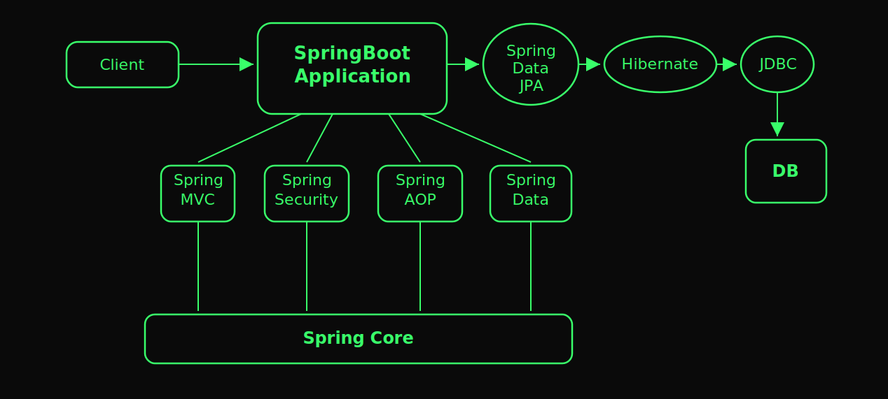
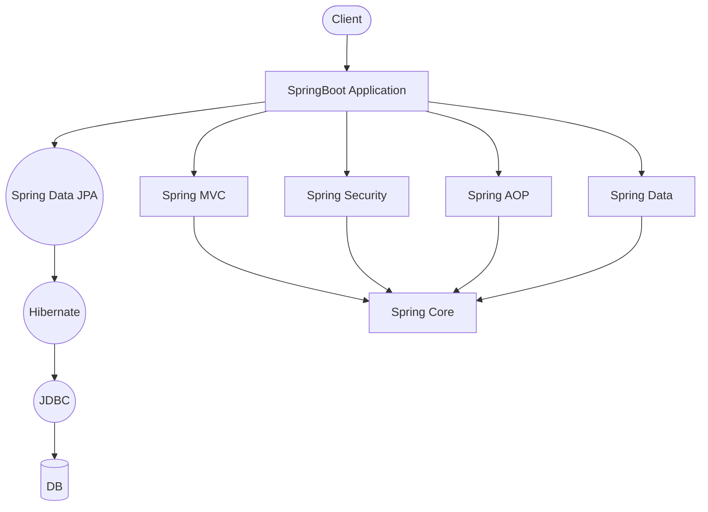

# Spring Boot Ecosystem — Layer Map

How a request moves from the client down through Spring's modules to the database, and which modules sit on top of Spring Core.

Mermaid version (renders natively on GitHub, no image file needed)

## What it means

| Path | Purpose |
|---|---|
| `Client → SpringBoot Application` | Entry point for every incoming request |
| `→ Spring Data JPA → Hibernate → JDBC → DB` | The persistence chain — JPA is the abstraction, Hibernate is the ORM implementing it, JDBC is the low-level DB driver layer |
| `Spring MVC / Security / AOP / Data` | Pluggable modules a SpringBoot Application can use, each built on top of... |
| `Spring Core` | ...the IoC/DI container every other module depends on |